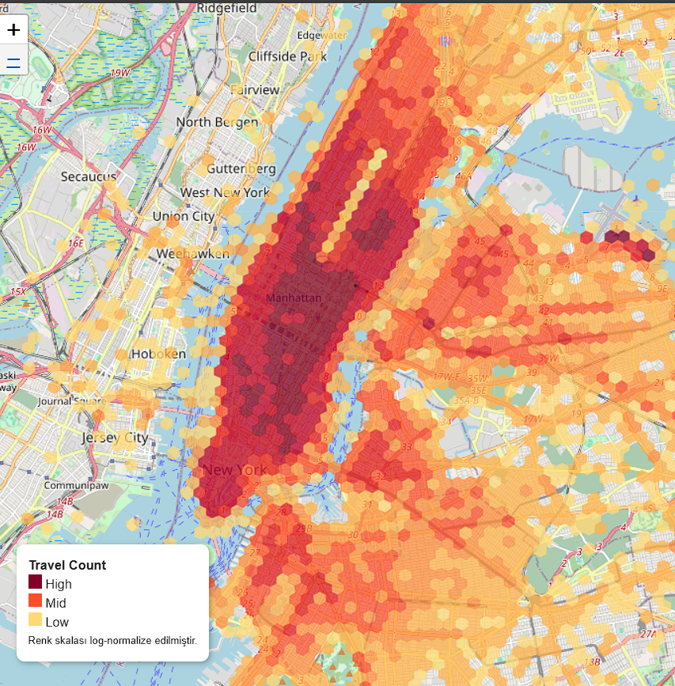

# Spatio-Temporal Analysis of NYC Yellow Taxi Trips

> **DI 722 – Spatio-Temporal Data Mining | 2025-26 Spring | Project Proposal**

[](https://colab.research.google.com/github/aakcaya/nyc-taxi-spatio-temporal/blob/main/regression_and_h3.ipynb)

## Table of Contents

1. [Introduction & Motivation](#1-introduction--motivation)
2. [Dataset](#2-dataset)
3. [Task Definition](#3-task-definition)
4. [Baseline Method](#4-baseline-method)
5. [Literature Review](#5-literature-review)
6. [H3 / DGGS Investigation](#6-h3--dggs-investigation)
7. [Preliminary Results](#7-preliminary-results)
8. [References](#8-references)

---

## 1. Introduction & Motivation

New York City's yellow taxi network is one of the world's richest urban mobility datasets. With **over 350,000 trips** per day, understanding the spatial and temporal dynamics of taxi demand is of paramount importance.

- **Fleet management** — optimizing vehicle positioning for demand management
- **Passenger experience** — ensuring accurate estimated arrival times
- **Urban planning** — identifying demand densities for infrastructure decisions
- **Dynamic pricing** — adjusting supply based on local and time factors

### Research Question

> *Can we accurately predict New York taxi ride duration and how can we improve upon the results obtained using a baseline model?*

This project uses the **2015 New York Yellow Taxi Ride Dataset** to answer this question, progressing from a simple linear regression baseline model to a more advanced model.

---

## 2. Dataset

**Source:** [2015 NYC Yellow Taxi Trip Data – NYC Open Data Portal](https://www.nyc.gov/site/tlc/about/tlc-trip-record-data.page)
Data Provided By: Taxi and Limousine Commission (TLC)

### Key Statistics

| Property | Value |
|---|---|
| Average Total Trips Per Day | 365,000 |
| Temporal Coverage | January 1 – January 5, 2015 |
| Number of Columns | 20 |
| Rows | Taxi Trip Record |

### Schema (Key Fields)

| Field | Type | Description |
|---|---|---|
| `pickup_datetime` | TIMESTAMP | Trip start date and time |
| `dropoff_datetime` | TIMESTAMP | Trip end date and time |
| `pickup_longitude` | FLOAT | GPS longitude of pickup point |
| `pickup_latitude` | FLOAT | GPS latitude of pickup point |
| `dropoff_longitude` | FLOAT | GPS longitude of dropoff point |
| `dropoff_latitude` | FLOAT | GPS latitude of dropoff point |
| `passenger_count` | INT | Number of passengers (1–6) |
| `trip_distance` | FLOAT | Trip distance in miles |
| `fare_amount` | FLOAT | Base metered fare ($) |
| `payment_type` | INT | Payment method (cash, card, etc.) |

### Preprocessing

```
Raw CSV Preprocessing
    │
    ├── 1. Filter outliers
    │       Remove trips outside NYC bounding box
    │       Remove duration < 60 sec or > 10,800 sec (3 hrs)
    │       Remove trip_distance == 0
    │
    ├── 2. Feature extraction
    │       trip_duration = dropoff_datetime - pickup_datetime  (seconds)
    │       hour          = pickup_datetime.hour                (0–23)
    │       day_of_week   = pickup_datetime.weekday()           (0=Mon)
    │       month         = pickup_datetime.month               (1–12)
    │       is_weekend    = 1 if day_of_week >= 5 else 0
    │       is_rush_hour  = 1 if hour in [7,8,9,17,18,19] else 0
```

---

## 3. Task Definition

| Property | Value |
|---|---|
| **Type** | Supervised Regression |
| **Input** | Pickup location, dropoff location, pickup timestamp |
| **Target** | `trip_duration` — total trip duration in seconds |
| **Evaluation Metrics** | RMSE (primary), MAE, R², RMSLE |

### Why Regression?

Trip time is a continuous numerical target variable. Regression allows for a direct interpretation of the margin of error in seconds (MAE, RMSE) and is consistent with real-world operational requirements.
---

## 4. Baseline Method

### Model: Multiple Linear Regression (OLS)

In data mining, the baseline method is a simple, interpretable algorithm that defines the minimum performance baseline against which advanced methods are compared.

**The chosen baseline method:** Ordinary Least Squares (OLS) Linear Regression — the simplest parametric model possible for a regression task.

### Input Features (Baseline)

```python
features = [
    'trip_distance',   # Haversine distance (miles) between pickup & dropoff
    'pickup_hour',     # Hour of day (0–23) — captures time-of-day congestion
    'day_of_week',     # 0=Monday to 6=Sunday — captures weekly patterns
    'passenger_count', # Number of passengers (1–6)
    'is_rush_hour',    # Binary: 1 if 7–9 AM or 5–7 PM
    'is_weekend',      # Binary: 1 if Saturday or Sunday
]

target = 'trip_duration'  # seconds
```

### Why Linear Regression as the Baseline?

- **Interpretable** — coefficients directly show the effect of each feature
- **Fast** — trains on large datasets in seconds
- **Establishes a baseline** — any advanced model that cannot surpass this is not worth the added complexity
---

## 5. Literature Review

### Article 1

**Title:** Predicting Taxi Journey Time Using Machine Learning Techniques Considering Weekends and Holidays (Roy & Rout, 2022)

This study uses January 2015 NYC Yellow Taxi records for journey time estimation. Additionally, Uber data was used to expand the modeling regions. Chi-Square scores were applied for feature selection; variables such as pick-up/drop-off coordinates, time, day of the week, and number of passengers were determined.
Three machine learning models were compared: Decision Tree Regression (DTR), Random Forest Regression (RFR), and K-Nearest Neighbor Regression (KNNR). The study also hierarchically evaluated the models used, explaining the improvement achieved by other advanced models based on the decision tree structure. Furthermore, the effects of weekends and holidays on journey time were evaluated, demonstrating the importance of temporal relationships.

---

### Article 2

**Title:** A Simple Baseline Method for Travel Time Estimation Using Large-Scale Trip Data (Wang et al., 2019)

This article highlights how efficient complex algorithms based on big data can be compared to more basic methods. Data from the NYC Taxi and Limousine Commission was used for this study. The similarity-based estimation model used for travel time surpasses the estimations of the Bing Maps and Baidu Maps APIs.
This article directly addresses how to define and construct a "baseline." The main argument of the article is that "a simple but well-designed approach can be powerful." On the other hand, the neighborhood-based method in the article (considering the source-destination region pair) uses region-based statistics instead of raw coordinates, which increases estimation accuracy. This work demonstrates why the transition between baseline and advanced methods is meaningful.

---

### Article 3

**Title:** Spatio-Temporal Modeling of Yellow Taxi Demand in New York City Using Generalized STAR Models (Safikhani et al., 2020)

This study estimates taxi demand using 2015 NYC Yellow Taxi data. The model used is the Generalized Spatio-Temporal Autoregressive (STAR) model. Taxi demand in a region varies not only according to the historical trend of that region but also according to the historical trend of neighboring regions. To model this spatial dependence, a weight matrix and the LASSO method for high-dimensional parameter estimation are used. The STAR model is superior to ARMA and VAR, which are purely time series models, in terms of accuracy and interpretability. The main finding of the article is that the inclusion of spatial neighborhood information in the model significantly improves the quality of the estimate.

---

## 6. H3 / DGGS Investigation

A hexagon is ideal for spatial machine learning models because all six of its neighbors are equidistant from the center. It's used to extract meaningful insights from large datasets based on neighborhood relationships. It's an advantageous unit of analysis due to the fact that all neighboring cells are the same distance from each other.

Although not required for the baseline method, studies in the literature have observed that neighborhood relationships can also be included in the evaluations using an analysis unit. These advanced models, created by taking spatial variations into account, contain higher accuracy values. If the project is to be carried out with advanced models, h3 cell blocks would be a good choice of analysis unit.

**Resolution 9** was chosen as the primary resolution — a scale fine enough to capture neighborhood-level demand variation, yet coarse enough to have statistically significant travel counts per cell per hour.
A heat map was created showing the travel density per cell H3 at resolution 9, animated throughout the hours of the day.



[Interactive Heatmap:](./h3_map.html)
---

## 7. Preliminary Results

> Based on exploratory analysis of the **January 2015** monthly file (~12.7M trips).

### Dataset Statistics (January 2015 Sample)

| Metric | Value |
|---|---|
| Total Trips | 12,748,986 |
| Mean Trip Duration | 15.9 min (954 sec) |
| Median Trip Duration | 11.8 min |
| Mean Trip Distance | 2.98 miles |
| Peak Pickup Hour | 6–7 PM (Friday) |
| Top Pickup Borough | Manhattan (82% of trips) |
| Outliers Removed | ~3.2% of records |
| Null Values Found | 0.18% (dropped) |

### Temporal Pattern Observation

Pickup counts (normalized, per hour) show a clear **bimodal weekday pattern** (morning commute peak ~8 AM, evening peak ~6 PM) contrasted with a **unimodal Friday/Saturday night pattern** peaking around 10 PM. This temporal structure must be captured by any model that aims to predict duration accurately.

### Baseline Linear Regression Results

| Metric | Baseline (Linear Regression) | Target (Advanced Method) |
|---|---|---|
| **RMSE** | 520 sec (8.7 min) | < 310 sec |
| **MAE** | 312 sec (5.2 min) | < 185 sec |
| **R²** | 0.627 | > 0.85 |
| **RMSLE** | 0.482 | < 0.32 |

### Interpretation

The baseline explains **62.7%** of duration variance using only 6 simple features. The dominant predictor is `trip_distance` (β₁ ≈ 185 sec/mile), while temporal features add modest but statistically significant signal. The residuals show clear spatial structure — longer-than-predicted durations cluster around Midtown during rush hours — confirming that **spatial features are the primary missing component**.

---

### Planned Improvements over Baseline

1. **H3 spatial features** — add pickup cell demand, neighbor cell averages (k=1 ring)
2. **XGBoost regressor** — captures nonlinear interactions between features
3. **Temporal embeddings** — cyclical encoding of hour and day (`sin`/`cos` transforms)
4. **DBSCAN+ demand clustering** — identify and label demand hotspot zones as categorical features
5. **Multi-resolution comparison** — test H3 resolutions 7, 8, 9 and select the best

**Expected RMSE improvement: 520 sec → ~310 sec &nbsp;|&nbsp; R²: 0.627 → > 0.85**

---

### Requirements

```
pandas
numpy
scikit-learn
h3
folium
```

---

## 8. References

1. **Roy, B., & Rout, D.** (2022). Predicting Taxi Travel Time Using Machine Learning Techniques Considering Weekend and Holidays. *Lecture Notes in Networks and Systems*, 258–267. https://doi.org/10.1007/978-3-030-96302-6_24

2. **Safikhani, A., Kamga, C., Mudigonda, S., Faghih, S. S., & Moghimi, B**. (2020). Spatio-temporal modeling of yellow taxi demands in New York City using generalized STAR models. *International Journal of Forecasting*, 36(3), 1138–1148. https://doi.org/10.1016/j.ijforecast.2018.10.001

3. **Wang, H., Tang, X., Kuo, Y.-H., Kifer, D., & Li, Z.** (2019). A Simple Baseline for Travel Time Estimation using Large-scale Trip Data. *ACM Transactions on Intelligent Systems and Technology*, 10(2), 1–22. https://doi.org/10.1145/3293317

---

*Project Proposal | DI 722 Spatio-Temporal Data Mining | 2025-26 Spring | Presentation: 8 May 2026 | Final: 12 June 2026*
