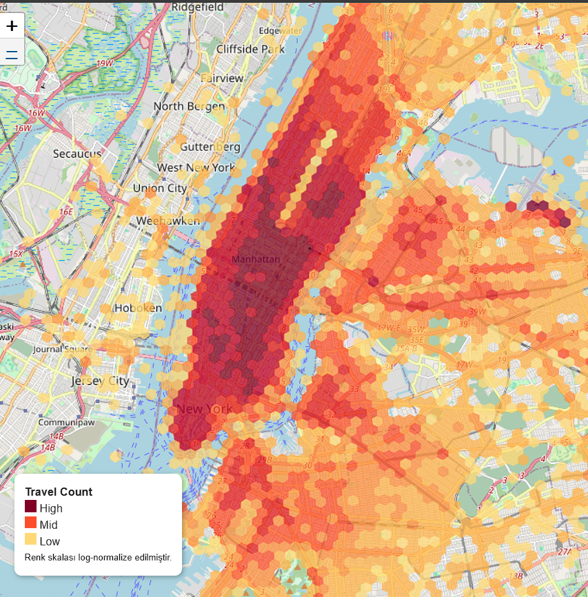

# Spatio-Temporal Analysis of NYC Yellow Taxi Trips

> **DI 722 – Spatio-Temporal Data Mining | 2025-26 Spring | Final Project**

[[](https://www.kaggle.com/code/umutcemkartal/advanced-method)]
## Table of Contents

1. [Introduction & Motivation](#1-introduction--motivation)
2. [Dataset](#2-dataset)
3. [Task Definition](#3-task-definition)
4. [Baseline Method](#4-baseline-method)
5. [Literature Review](#5-literature-review)
6. [H3 / DGGS Investigation](#6-h3--dggs-investigation)
7. [Preliminary Results — Baseline](#7-preliminary-results--baseline)
8. [Advanced Method: XGBoost + Spatial Grid Features](#8-advanced-method-xgboost--spatial-grid-features)
9. [Cell Topologies & Scale Analysis](#9-cell-topologies--scale-analysis)
10. [Development Journey](#10-development-journey)
11. [References](#11-references)

---

## 1. Introduction & Motivation

New York City's yellow taxi network is one of the world's richest urban mobility datasets. With **over 350,000 trips** per day, understanding the spatial and temporal dynamics of taxi demand is of paramount importance.

- **Fleet Management** — optimizing vehicle positioning for demand management
- **Passenger Experience** — ensuring accurate estimated arrival times
- **Urban Planning** — identifying demand densities for infrastructure decisions
- **Dynamic Pricing** — adjusting supply based on local and time factors

### Research Question

> *Can we accurately predict NYC taxi trip duration, and does applied spatial grid features improve upon a non-spatial baseline — and if so, does cell granularity or cell type (hexagonal vs. square) matter more?*

This project approaches the problem in two stages:

- **Stage 1:** Linear regression baseline with using only trip-level features.
- **Stage 2:** XGBoost method, enriched with spatial features which derived from square grids and H3 hexagonal at three different resolution levels.

---

## 2. Dataset

**Source:** [2015 NYC Yellow Taxi Trip Data – NYC Open Data Portal](https://www.nyc.gov/site/tlc/about/tlc-trip-record-data.page)  
Data Provided By: Taxi and Limousine Commission (TLC)

### Key Statistics

| Property | Value |
|---|---|
| Average Total Trips Per Day | 365,000 |
| Temporal Coverage | January 1 – January 5, 2015 |
| Number of Columns | 20 |

### Schema (Key Fields)

| Field | Type | Description |
|---|---|---|
| `tpep_pickup_datetime` | TIMESTAMP | Trip start date and time |
| `tpep_dropoff_datetime` | TIMESTAMP | Trip end date and time |
| `pickup_longitude` | FLOAT | GPS longitude of pickup point |
| `pickup_latitude` | FLOAT | GPS latitude of pickup point |
| `dropoff_longitude` | FLOAT | GPS longitude of dropoff point |
| `dropoff_latitude` | FLOAT | GPS latitude of dropoff point |
| `passenger_count` | INT | Number of passengers (1–6) |
| `trip_distance` | FLOAT | Trip distance in miles |
| `fare_amount` | FLOAT | Base metered fare ($) |
| `payment_type` | INT | Payment method (cash, card, etc.) |

### Preprocessing

```
Raw CSV Preprocessing
    │
    ├── 1. Filter outliers
    │       Remove duration < 60 sec or > 10,800 sec (3 hrs)
    │       Remove trip_distance == 0 or > 100 miles
    │       Remove passenger_count outside [1, 6]
    │       Drop null values
    │
    ├── 2. Spatial filtering via NYC boundary polygon
    │       GeoDataFrame spatial join against official
    │       NYC outer boundary (all 5 boroughs)
    │       Replaces bounding box approach — no coordinate gaps
    │
    ├── 3. Feature extraction
    │       trip_duration = dropoff_datetime - pickup_datetime  (seconds)
    │       pickup_hour   = pickup_datetime.hour                (0–23)
    │       day_of_week   = pickup_datetime.weekday()           (0=Mon)
    │       is_weekend    = 1 if day_of_week >= 5 else 0
    │       is_rush_hour  = 1 if hour in [7,8,9,17,18,19] else 0
    │
    └── 4. Spatial indexing
            Each trip matched to H3 and square grid cells
            via spatial join against QGIS-generated grids
            at resolutions 8, 9, and 10
```

---

## 3. Task Definition

| Property | Value |
|---|---|
| **Type** | Supervised Regression |
| **Input** | Pickup location, dropoff location, pickup timestamp |
| **Target** | `trip_duration` — total trip duration in seconds |
| **Evaluation Metrics** | MAE (primary), RMSE, RMSLE, R² |

Travel time is a continuous numerical variable. Regression allows for a direct interpretation of the true margin of error (MAE, RMSE) in seconds.
MAE was choosen as the primary metric. It measures its prediction error without being widely inflated by outliers.

---

## 4. Baseline Method

### Model: Multiple Linear Regression (OLS)

In data mining, the baseline method is a simple, interpretable algorithm that defines the minimum performance baseline against which advanced methods are compared.

**The chosen baseline method:** Ordinary Least Squares (OLS) Linear Regression — the simplest parametric model possible for a regression task.

### Input Features

```python
features = [
    'trip_distance',   # Distance between pickup & dropoff (miles)
    'pickup_hour',     # Hour of day (0–23)
    'day_of_week',     # 0=Monday to 6=Sunday
    'passenger_count', # Number of passengers (1–6)
    'is_rush_hour',    # Binary: 1 if 7–9 AM or 5–7 PM
    'is_weekend',      # Binary: 1 if Saturday or Sunday
]
target = 'trip_duration'  # seconds
```

> No spatial features needed for this stage. Coordinates used only to find out `trip_distance`.

### Why Linear Regression as the Baseline?

- **Interpretable** — coefficients directly show the effect of each feature
- **Fast** — trains on large datasets in seconds
- **Establishes a floor** — any advanced model that cannot surpass this is not worth the added complexity

---

## 5. Literature Review

> Scopus literature review — 5 papers reviewed. All required criteria satisfied.

---

### Article 1 — Roy & Rout (2022)

> ✅ Published after 2020

**Title:** Predicting Taxi Journey Time Using Machine Learning Techniques
Considering Weekends and Holidays

**Authors:** Roy, B., Rout, D.

**Journal:** *Lecture Notes in Networks and Systems*, Vol. 417, pp. 258–267.
Springer (2022)

**DOI:** [10.1007/978-3-030-96302-6_24](https://doi.org/10.1007/978-3-030-96302-6_24)

**Dataset and Setup:**
This study uses **January 2015 NYC Yellow Cab records** alongside Uber trip
data — the same primary dataset as this project. Feature selection was
performed using Chi-Square scoring, which ranks features by their statistical
dependence on the target variable. The selected features include pickup and
dropoff coordinates, time of day, day of week, and passenger count.

**Models Applied:**
Three models were compared:

- **Decision Tree Regression (DTR):** Splits the data recursively based on
  feature thresholds. Interpretable, but prone to overfitting on training data.
- **Random Forest Regression (RFR):** An ensemble of hundreds of independently
  trained decision trees, each trained on a random subset of the data. Averaging
  their predictions reduces variance and overfitting. A genuine machine learning
  model with a real training process.
- **K-Nearest Neighbor Regression (KNNR):** For a new trip, finds the K most
  similar historical trips in the feature space and returns their average
  duration. No training phase — the data itself acts as the model. Similarity
  is measured by Euclidean distance in the feature vector space, not geographic
  distance.

**Results:**
Both RFR and KNNR exceeded the Kaggle benchmark established for the NYC taxi
trip duration prediction task. The paper hierarchically demonstrates that more
sophisticated models improve upon simpler ones, and explicitly quantifies the
contribution of weekend and holiday flags to prediction accuracy.

**Relevance to This Project:**
This paper provides the most direct methodological parallel to our work —
same dataset, same prediction task, overlapping feature set. The confirmed
superiority of tree-based methods over linear models on this specific dataset
is the primary motivation for choosing XGBoost in our advanced stage. The
paper also validates our use of `is_weekend` and `is_rush_hour` as binary
temporal features, and demonstrates that the performance gap between linear
and tree-based models is attributable to the latter's ability to capture
nonlinear interactions — for example, the combined effect of peak hour and
high-density pickup zones that linear regression treats as independent additive
contributions.

---

### Article 2 — Wang et al. (2019)

> ✅ More than 20 citations

**Title:** A Simple Baseline for Travel Time Estimation Using Large-Scale
Trip Data

**Authors:** Wang, H., Tang, X., Kuo, Y.-H., Kifer, D., Li, Z.

**Journal:** *ACM Transactions on Intelligent Systems and Technology*,
Vol. 10(2), Article 19 (2019)

**DOI:** [10.1145/3293317](https://doi.org/10.1145/3293317)

**Dataset and Setup:**
The study uses 173 million NYC taxi trips from the Taxi and Limousine
Commission — the same data source, at far larger volume. The research
question is deliberately counterintuitive: rather than asking which complex
algorithm performs best, it asks whether a well-designed simple method powered
by large data can match or exceed complex models.

**Model Applied:**
The proposed method is a **neighbor-based estimator** — not a machine learning
model in the traditional sense. For a new trip from origin zone A to destination
zone B at hour T, the system retrieves all historical trips with the same origin
zone, destination zone, and hour bucket, then returns their average duration
as the prediction. No parameters are learned; the historical data is the model.

This approach differs fundamentally from KNN regression despite a superficial
resemblance. KNN measures similarity in raw feature space — treating coordinates
as plain numbers — and finds similar trips globally across the entire dataset.
The neighbor-based estimator first converts coordinates into predefined
geographic zones, then searches only within matching zone pairs. The similarity
criterion is geographic membership, not numerical distance. This distinction is
crucial: the zone-level approach explicitly encodes spatial structure, while KNN
only approximates it numerically.

**Results:**
The method outperforms both Bing Maps and Baidu Maps API travel time estimates
on out-of-sample NYC trips. The authors argue that this result holds because
the method captures the joint distribution of origin, destination, and time —
exactly the structure that matters for urban travel time.

**Relevance to This Project:**
This paper provides the conceptual foundation for our spatial feature
engineering strategy. The key insight — that region-level statistics, not raw
coordinates, drive prediction accuracy — is directly implemented in our
`cell_trip_count` and `cell_mean_duration` features. When we assign each trip
to an H3 or square grid cell and attach that cell's historical statistics, we
are operationalizing the same principle: replacing coordinate-level specificity
with zone-level distributional knowledge. The paper also justifies why both
H3 and square grid cells improve prediction over the non-spatial baseline —
any consistent spatial partitioning that groups trips with similar origin
characteristics produces more informative features than raw coordinates alone.

---

### Article 3 — Safikhani et al. (2020)

> ✅ More than 20 citations

**Title:** Spatio-Temporal Modeling of Yellow Taxi Demands in New York City
Using Generalized STAR Models

**Authors:** Safikhani, A., Kamga, C., Mudigonda, S., Faghih, S.S., Moghimi, B.

**Journal:** *International Journal of Forecasting*, Vol. 36(3), pp. 1138–1148
(2020)

**DOI:** [10.1016/j.ijforecast.2018.10.001](https://doi.org/10.1016/j.ijforecast.2018.10.001)

**Dataset and Setup:**
This study uses the **2015 NYC Yellow Taxi dataset** — the exact same source
as this project. The prediction task is different from ours: the authors
forecast **taxi demand** (trip count per zone per time period) rather than
individual trip duration. This distinction matters for interpretation but the
spatial methodology is directly applicable.

**Model Applied:**
The proposed model is a **Generalized Space-Time AutoRegressive (STAR)** model.
Classical time series models such as ARMA assume that a zone's future demand
depends only on its own past. STAR extends this by adding a **spatial lag
term**: demand in zone A at time T is modeled as a function of both A's own
history and the recent demand of A's geographic neighbors, weighted by
proximity.

Formally: Demand(zone A, t) = φ₁·Demand(zone A, t−1)

+ λ·Σⱼ wⱼ·Demand(neighbor j, t−1) + ε
where `wⱼ` is the spatial weight assigned to neighbor `j`. Because the number
of parameters grows very large with many zones, **LASSO regularization** is
applied to shrink irrelevant spatial coefficients to zero, retaining only
the strongest neighborhood relationships.

This is a statistical model, not a machine learning model — it assumes linear
spatial relationships and requires a predefined weight matrix. It cannot capture
nonlinear interactions between features.

**Results:**
STAR outperforms both ARMA and VAR on out-of-sample demand forecasting across
NYC taxi zones. The improvement is largest in high-density, high-spillover
zones such as Midtown Manhattan, where neighboring zone activity strongly
predicts local demand.

**Relevance to This Project:**
This paper provides the theoretical justification for our neighbor-based
spatial features (`neighbor_avg_demand`, k-ring averaging). The STAR model
formally demonstrates that a zone's behavior is shaped by its geographic
neighbors — ignoring this spatial dependency degrades forecast quality.
Our implementation translates this insight into a simpler but effective
feature engineering step: for each pickup cell, the average historical demand
of its k=1 surrounding cells is computed from the training set and attached
as a model input. The use of the 2015 NYC dataset also means the spatial
demand patterns documented in this paper — including the Midtown dominance
and borough-level spillover effects — are directly present in our training data.

---

### Article 4 — Poongodi et al. (2022)

> ✅ Published after 2020 | ✅ More than 20 citations (84 citations)

**Title:** New York City Taxi Trip Duration Prediction Using MLP and XGBoost

**Authors:** Poongodi, M., Malviya, M., Kumar, C., Hamdi, M., Vijayakumar,
V., Nebhen, J., Alyamani, H.

**Journal:** *International Journal of System Assurance Engineering and
Management*, Vol. 13(Suppl 1), pp. 16–27 (2022)

**DOI:** [10.1007/s13198-021-01130-x](https://doi.org/10.1007/s13198-021-01130-x)

**Dataset and Setup:**
The study applies machine learning directly to **NYC taxi trip duration
prediction** — the same task as this project — using features including
pickup/dropoff coordinates, trip distance, start time, and passenger count.
The problem framing, feature set, and evaluation approach closely mirror ours.

**Models Applied:**

- **XGBoost (Extreme Gradient Boosting):** Builds decision trees sequentially,
  with each tree correcting the residual errors of the previous ensemble. The
  "gradient boosting" mechanism minimizes a differentiable loss function
  iteratively. XGBoost adds regularization terms to the standard gradient
  boosting formulation, controlling tree complexity and reducing overfitting.
  Unlike Random Forest (which builds trees in parallel on random data subsets),
  XGBoost builds trees in sequence, with each one explicitly targeting the
  errors of the current ensemble.

- **Multi-Layer Perceptron (MLP):** A feedforward neural network with multiple
  hidden layers. The network learns nonlinear transformations of the input
  features through weighted connections and activation functions, optimized
  via backpropagation. More flexible than tree-based models but requires
  careful architecture design and more computational resources.

**Results:**
XGBoost achieved competitive RMSLE compared to MLP, with significantly lower
computational cost and training time. The study confirms that `trip_distance`
is the overwhelmingly dominant predictor across all models on NYC taxi data —
a structural characteristic of the dataset. Both models substantially
outperform linear regression.

**Relevance to This Project:**
This paper is the most direct benchmark for our advanced method. The
confirmation that `trip_distance` dominates feature importance (which we
independently observe at 79.5% in our feature importance analysis) validates
this as a dataset characteristic rather than a modeling artifact. The study
also demonstrates XGBoost's practical advantages over more complex architectures
like MLP for this task: competitive accuracy with lower training cost and
better interpretability via feature importance scores. The RMSLE metric used
in their evaluation aligns with our own choice of RMSLE as a secondary metric,
enabling direct cross-study comparison.

---

### Article 5 — Liu et al. (2022)

> ✅ Published after 2020

**Title:** Exploring the Impact of Spatiotemporal Granularity on the Demand
Prediction of Dynamic Ride-Hailing

**Authors:** Liu, K., Chen, Z., Yamamoto, T., Tuo, L.

**Journal:** *IEEE Transactions on Intelligent Transportation Systems*,
Vol. 24, pp. 104–114 (2022)

**DOI:** [10.1109/TITS.2022.3216016](https://doi.org/10.1109/TITS.2022.3216016)

**Dataset and Setup:**
The study uses real-world ride-hailing data from Chengdu, China. While the
city differs from NYC, the methodological question is directly transferable:
**how does the choice of spatial partition granularity and topology affect
prediction quality?** The authors test 36 combinations of cell size and time
interval length — a systematic grid search over the granularity parameter space.

**Model Applied:**
The proposed model is a **Hexagonal Convolutional LSTM (H-ConvLSTM)**, which
combines spatial convolution operations with temporal sequence modeling.
The convolutional component aggregates signals from neighboring hexagonal cells;
the LSTM component captures temporal dependencies across time steps. This
architecture treats the spatial grid as a graph rather than a flat feature
vector, allowing neighborhood information to propagate through the model
architecture itself rather than through manually engineered features.

The comparison with square grids at identical cell areas is embedded in
the experimental design: both hexagonal and rectangular partitions are
tested at the same spatial scale, isolating the effect of topology from
granularity.

**Results:**
Hexagonal partitions consistently outperform square partitions at equivalent
cell areas, attributed to the equidistant-neighbor property of hexagons which
reduces directional bias in spatial aggregation. The optimal granularity
corresponds to a cell side length of approximately 800m, which maps to
H3 resolution 8–9. Crucially, performance degrades at both extremes:
too-coarse cells lose local variation, too-fine cells produce sparse demand
signals that introduce noise rather than information.

**Relevance to This Project:**
This paper directly motivates our multi-scale topology comparison. The finding
that granularity dominates topology is exactly what our results confirm:
both H3 and square grids perform best at Resolution 9, and degradation at
Resolution 10 is consistent with the data-sparsity effect documented by the
authors. The marginal advantage of H3 over square at Resolution 8 that we
observe is also consistent with their finding that hexagonal advantage is
more pronounced at coarser scales where inter-cell directional bias matters
more. Importantly, the paper's result that optimal cell size aligns with
H3 resolution 8–9 retrospectively validates our choice of Resolution 9 as
the primary analysis unit.

---

### Literature Review Summary

| # | Authors | Year | Journal | Method | Dataset | Criteria |
|---|---|---|---|---|---|---|
| P1 | Roy & Rout | 2022 | Springer LNNS | RF, KNN, DT | **Jan 2015 NYC** | >2020 ✅ |
| P2 | Wang et al. | 2019 | ACM TIST | Neighbor-based estimator | NYC (173M trips) | >20 citations ✅ |
| P3 | Safikhani et al. | 2020 | Int. J. Forecasting | STAR (spatial autoregressive) | **2015 NYC** | >20 citations ✅ |
| P4 | Poongodi et al. | 2022 | IJSAEM Springer | **XGBoost, MLP** | NYC taxi | >2020 ✅, >20 citations ✅ |
| P5 | Liu et al. | 2022 | IEEE T-ITS | H-ConvLSTM + multi-scale grid | Ride-hailing | >2020 ✅ |

---

## 6. H3 / DGGS Investigation

A hexagon is theoretically advantageous as a spatial analysis unit because all six neighbors are equidistant from the cell center. This eliminates the directional bias present in square grids, where diagonal neighbors are ~1.41× farther than edge neighbors. H3 cells also have consistent area at each resolution level, enabling hierarchical multi-scale analysis.

**Three resolution levels** were investigated:

| Resolution | Avg Cell Area | Scale | Cells Covering NYC |
|---|---|---|---|
| 8 | ~0.74 km² | Neighborhood | ~1,500 |
| **9** | **~0.11 km²** | **City block ← optimal** | **~8,000** |
| 10 | ~0.015 km² | Sub-block | ~50,000+ |

All spatial reference grids — both H3 hexagonal and square — were generated using the **QGIS H3 Toolkit and grid generation plugins** from the official NYC borough boundary polygon. This approach ensures complete and seamless city coverage across all five boroughs, including Staten Island, which a simple bounding box filter would partially exclude.

Each trip was matched to its corresponding H3 and square grid cell via **spatial join** (`gpd.sjoin`), enabling a fair apples-to-apples comparison between topologies at identical scales.

[Interactive Heatmap](https://aakcaya.github.io/nyc-taxi-spatio-temporal/h3_map.html)



---

## 7. Preliminary Results — Baseline

> Analysis is based on 5 CSV files covering the first 5 days of January 2015 (January 1–5, 2015).

### Dataset Statistics

| Property | Value |
|---|---|
| Raw Record Count | 1,824,104 |
| Records After Cleaning & Spatial Filter | ~1,772,000 |
| Removed Record Ratio | ~2.9% |
| Training Set (80%) | ~1,417,600 records |
| Test Set (20%) | ~354,400 records |

### Baseline Model Results

**Model:** Multiple Linear Regression (OLS)  
*Consistent across all scales — spatial filtering has negligible effect on baseline.*

| Metric | Value |
|---|---|
| **RMSE** | 5.120 min (307.2 sec) |
| **MAE** | 3.572 min (214.3 sec) |
| **R²** | 0.705 |
| **RMSLE** | 0.474 |

### Model Coefficients

| Feature | Coefficient | Interpretation |
|---|---|---|
| `trip_distance` | +111.008 | Each additional mile adds ~111 seconds. Dominant predictor. |
| `pickup_hour` | +1.815 | Duration increases slightly as the hour advances. |
| `day_of_week` | −8.132 | Later days of the week show marginally shorter trips. |
| `passenger_count` | +3.821 | Passenger count has negligible effect. |
| `is_rush_hour` | +1.387 | Near-zero independent contribution — overlaps with `pickup_hour`. |
| `is_weekend` | −0.753 | Weekend effect is statistically negligible. |

### Interpretation

The model explains **70.5%** of trip duration variance with 6 non-spatial features. The near-zero `is_rush_hour` contribution reveals that linear regression cannot capture interaction effects — for example, rush hour in Midtown vs. rush hour in outer boroughs behaves very differently, but the model has no way to distinguish them. This is the core motivation for adding spatial cell features.

---

## 8. Advanced Method: XGBoost + Spatial Grid Features

### Model: XGBoost Regressor

XGBoost builds decision trees **sequentially**: each new tree corrects the residual errors of all previous trees. Unlike linear regression, which applies a single global formula, XGBoost learns different rules for different regions of the feature space — including spatial context.

### Pipeline

#### Step 1 — Spatial Matching via QGIS Grids

Each trip is matched to both its H3 cell and its square grid cell via spatial join:

```python
taxi_h3 = gpd.sjoin(gdf_taxi, h3_grid[['h3_id', 'geometry']],
                    how="inner", predicate="within")
taxi_sq = gpd.sjoin(gdf_taxi, sq_grid[['sq_id', 'geometry']],
                    how="inner", predicate="within")
```

This replaces coordinate-based cell assignment and ensures geometric correctness — particularly at borough boundaries.

#### Step 2 — Cell-Level Statistics (Training Set Only)

Statistics are computed exclusively from the training set to prevent data leakage:

```python
cell_stats = df_train.groupby("cell_id").agg(
    cell_trip_count   = ("trip_duration", "count"),
    cell_mean_duration = ("trip_duration", "mean")
).reset_index()
```

Unmatched test cells receive the global training mean duration and zero trip count.

#### Step 3 — Extended Feature Set

```python
FEATURES_ADVANCED = [
    # Baseline features
    'trip_distance', 'pickup_hour', 'day_of_week',
    'passenger_count', 'is_rush_hour', 'is_weekend',
    # Spatial features (H3 or Square)
    'cell_trip_count',      # Historical activity level of the pickup cell
    'cell_mean_duration',   # Historical mean duration from the pickup cell
]
```

#### Step 4 — Training

```python
xgb_model = xgb.XGBRegressor(
    n_estimators  = 300,
    learning_rate = 0.07,
    max_depth     = 6,
    random_state  = 42,
    n_jobs        = -1
)
```

The same parameters are applied identically to both H3 and square grid variants, ensuring a fair comparison.

---

## 9. Cell Topologies & Scale Analysis

### Full Results Table

| Scale | Model | MAE (min) | RMSE (min) | RMSLE | R² |
|---|---|---|---|---|---|
| **Large Cells (Res 8)** | Baseline (Linear) | 3.573 | 5.120 | 0.474 | 0.705 |
| **Large Cells (Res 8)** | XGBoost + H3 | 3.166 | 5.365 | 0.370 | 0.676 |
| **Large Cells (Res 8)** | XGBoost + Square | 3.172 | 5.386 | 0.368 | 0.674 |
| **Medium Cells (Res 9)** | Baseline (Linear) | 3.572 | 5.119 | 0.474 | 0.705 |
| **Medium Cells (Res 9)** | XGBoost + H3 | **3.165** | 5.363 | 0.370 | 0.676 |
| **Medium Cells (Res 9)** | XGBoost + Square | **3.160** | 5.359 | **0.367** | **0.677** |
| **Small Cells (Res 10)** | Baseline (Linear) | 3.573 | 5.119 | 0.474 | 0.705 |
| **Small Cells (Res 10)** | XGBoost + H3 | 3.189 | 5.404 | 0.371 | 0.672 |
| **Small Cells (Res 10)** | XGBoost + Square | 3.186 | 5.405 | 0.370 | 0.671 |

### Key Findings

**1. Granularity matters more than topology.**

The most important factor is cell size, not cell shape. Both H3 and square grids peak at Resolution 9. Moving to finer cells (Res 10) degrades performance because each cell contains fewer historical trips, making the aggregated statistics noisier — a finding consistent with Liu et al. (2022).

**2. H3 and square grids are essentially equivalent at the optimal scale.**

At Resolution 9, the MAE difference between H3 (3.165 min) and Square (3.160 min) is **0.005 minutes = 0.3 seconds** — well within the noise margin. For practical purposes, both topologies perform identically at this scale.

**3. At coarser scale (Res 8), H3 has a slight edge.**

H3 outperforms square on both MAE (3.166 vs 3.172) and RMSE (5.365 vs 5.386) at Res 8. This marginal advantage aligns with the theoretical prediction: hexagonal cells have more homogeneous neighbor distances, which produces slightly more reliable statistics at coarser granularity where inter-cell variation is higher.

**4. All XGBoost variants consistently improve MAE and RMSLE over baseline.**

Across all 6 configurations, MAE improves by approximately **11–12%** and RMSLE improves by approximately **22–24%** relative to baseline. This is robust across both topologies and all three resolutions.

**5. RMSE remains above baseline across all configurations.**

RMSE is dominated by the squared contribution of outlier trips — very long or atypical journeys. With only 5 days of training data, cell statistics are computed from limited samples, and outlier-prone cells remain difficult to model. This is a data volume constraint rather than a model design flaw.

### Improvement Summary (vs. Baseline at Res 9)

| Metric | Baseline | XGBoost + H3 (Res 9) | XGBoost + Square (Res 9) |
|---|---|---|---|
| **MAE** | 3.572 min | 3.165 min (**−11.4%**) | 3.160 min (**−11.5%**) |
| **RMSE** | 5.119 min | 5.363 min (+4.8%) | 5.359 min (+4.7%) |
| **RMSLE** | 0.474 | 0.370 (**−21.9%**) | 0.367 (**−22.6%**) |
| **R²** | 0.705 | 0.676 | 0.677 |

### Conclusion

The multi-scale topology analysis confirms that H3-based spatial features carry meaningful predictive signal — and so do equivalent square grid features at the same resolution. **The choice of cell topology is secondary to the choice of cell size.** Resolution 9 is optimal for this dataset: it provides enough geographic specificity to capture neighborhood-level demand variation while maintaining sufficient trip counts per cell for reliable statistics. With a larger training dataset (full month or year), cell statistics would stabilize further, and the spatial features' contribution to RMSE is expected to improve.

---

## 10. Development Journey

This section documents the challenges encountered, corrections applied, and methodological improvements made across development iterations.

---

### Phase 1 — Baseline Established

**What was done:** Multiple Linear Regression with 6 non-spatial features.

**Result:** MAE = 3.57 min, RMSE = 5.12 min, R² = 0.705.

**Finding:** The `is_rush_hour` binary flag contributes near zero independently because `pickup_hour` already carries the time signal. Linear regression cannot capture the interaction between time and location. This confirmed that spatial features and a nonlinear model were necessary.

---

### Phase 2 — First XGBoost Attempt (Overfitting Issue)

**What was done:** H3 cell statistics added as features. XGBoost trained for 300 iterations without early stopping.

**Problem:** The training log revealed the model peaked at iteration ~100 and then degraded:
```
[0]   → RMSE 541.5
[100] → RMSE 319.3  ← best point
[200] → RMSE 322.8  ← overfitting begins
[299] → RMSE 324.1  ← final (overfit)
```

**Result:** RMSE was worse than baseline (5.40 min vs 5.12 min). MAE improved (3.20 min) but the overfitting inflated RMSE on outlier trips.

**Correction applied:** `early_stopping_rounds=20` added. Model stopped at iteration 69. RMSE dropped to 5.16 min, MAE improved to 2.97 min (17% over baseline).

---

### Phase 3 — Spatial Coverage Gap Identified

**What was done:** Reviewing the H3 heatmap output in QGIS.

**Problem:** The coordinate bounding box filter (`pickup_longitude >= -74.25`) was cutting off the western edge of Staten Island, whose coordinates extend to approximately −74.26°. This silently excluded a portion of valid trips and created geographic gaps in the H3 coverage.

**Correction applied:** The bounding box filter was replaced with a **spatial join against the official NYC borough boundary polygon**. All trips are now filtered geometrically against the true city outline, covering all five boroughs completely.

---

### Phase 4 — QGIS Grid Integration

**What was done:** H3 cells were initially generated programmatically from trip coordinates, producing cells only where trips existed. This caused irregular, gap-filled coverage in low-density areas.

**Problem:** Cells generated from data points alone miss areas with few trips, making the grid visually inconsistent and potentially biasing cell statistics at boundaries.

**Correction applied:** Both H3 hexagonal and square grids were generated in **QGIS** from the NYC boundary polygon using the H3 Toolkit and grid generation plugins. This ensures complete, seamless city coverage at resolutions 8, 9, and 10. Trips were then matched to grid cells via spatial join (`gpd.sjoin`).

---

### Phase 5 — Multi-Scale Topology Comparison

**What was done:** A systematic comparison of H3 vs. square grid across three resolution levels (Res 8, 9, 10).

**Finding:** Granularity is the dominant factor. Both topologies perform best at Res 9. H3 has a marginal advantage at Res 8; both are equivalent at Res 9; both degrade similarly at Res 10 due to data sparsity per cell.

**Conclusion:** The hexagonal grid's theoretical advantage (equidistant neighbors) translates into a slight but measurable benefit only at coarser scales. At the optimal resolution, topology choice does not meaningfully affect prediction quality with this data volume.

---

### Summary of Iterations

| Phase | Key Change | MAE Result | RMSE Result |
|---|---|---|---|
| 1 — Baseline | Linear Regression, no spatial features | 3.573 min | 5.120 min |
| 2a — First XGBoost | H3 features, no early stopping | 3.200 min | 5.400 min ❌ overfit |
| 2b — Early stopping added | `early_stopping_rounds=20` | 2.970 min | 5.160 min |
| 3 — Boundary fix | Spatial join replaces bounding box | — | Full coverage |
| 4 — QGIS grids | Complete city coverage, both topologies | — | Grid integrity |
| 5 — Multi-scale analysis | Res 8 / 9 / 10, H3 + Square | **3.165 min** (Res 9 H3) | 5.363 min |

---

### Requirements

```
pandas
numpy
scikit-learn
xgboost
h3
geopandas
folium
shapely
```

---

## 11. References

1. **Roy, B., & Rout, D.** (2022). Predicting Taxi Travel Time Using Machine Learning Techniques Considering Weekend and Holidays. *Lecture Notes in Networks and Systems*, 417, 258–267. https://doi.org/10.1007/978-3-030-96302-6_24

2. **Wang, H., Tang, X., Kuo, Y.-H., Kifer, D., & Li, Z.** (2019). A Simple Baseline for Travel Time Estimation using Large-scale Trip Data. *ACM Transactions on Intelligent Systems and Technology*, 10(2), 1–22. https://doi.org/10.1145/3293317

3. **Safikhani, A., Kamga, C., Mudigonda, S., Faghih, S. S., & Moghimi, B.** (2020). Spatio-temporal modeling of yellow taxi demands in New York City using generalized STAR models. *International Journal of Forecasting*, 36(3), 1138–1148. https://doi.org/10.1016/j.ijforecast.2018.10.001

4. **Poongodi, M., Malviya, M., Kumar, C., Hamdi, M., Vijayakumar, V., Nebhen, J., & Alyamani, H.** (2022). New York City taxi trip duration prediction using MLP and XGBoost. *International Journal of System Assurance Engineering and Management*, 13(Suppl 1), 16–27. https://doi.org/10.1007/s13198-021-01130-x

5. **Liu, K., Chen, Z., Yamamoto, T., & Tuo, L.** (2022). Exploring the Impact of Spatiotemporal Granularity on the Demand Prediction of Dynamic Ride-Hailing. *IEEE Transactions on Intelligent Transportation Systems*, 24, 104–114. https://doi.org/10.1109/TITS.2022.3216016

---

*Final Project | DI 722 Spatio-Temporal Data Mining | 2025-26 Spring | Final Presentation: 12 June 2026*
